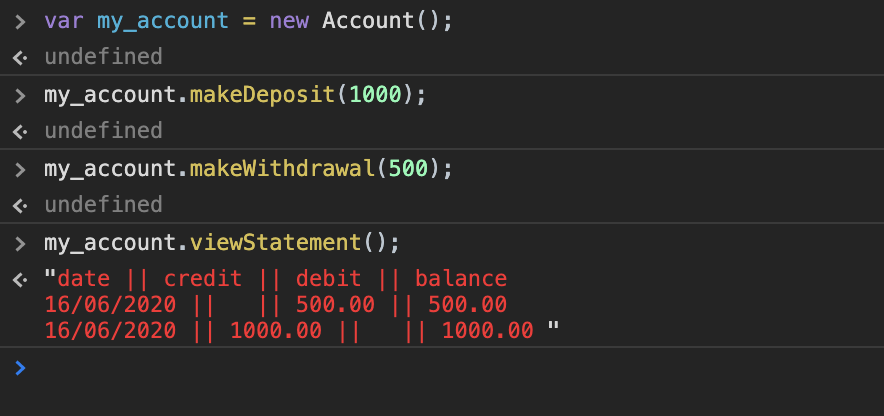

## Bank Tech Test

This project is my submission for the Bank Tech  Test challenge completed as part of week 10 of the  Makers Academy course.

It is a tool run in the command line that mimics a bank account and allows a user to deposit and withdraw money as well as viewing a bank statement of their transaction history.

## Using Bank Tech Test

To use this on your local computer, follow these steps:

  1. Clone this repository to your local computer and navigate to the root directory using the command `cd /TechTests/BankTest`.
  2. Open the index.html file on Google Chrome and right click the page.
  3. Click inspect in the drop down menu and the Google Developer tools should open on the right hand side.
  4. Click on the console tab and type in the run commands listed on the web page to use Bank Tech Test.

The run commands listed are as follows:

* `var <your_account_name> = new Account()` - To make a new account
* `<your_account_name>.makeDeposit(amount)`- To make a deposit. The amount entered must be a positive integer.
* `<your_account_name>.makeWithdrawal(amount)`- To make a withdrawal. The amount entered must be a positive integer.
* `<your_account_name>.viewStatement`- To view your transaction history. A table will be printed to your console.

Here's an example you could follow to get started:

  1. Start by making an Account with `var my_account = new Account()`
  2. Deposit £1000 into your account `my_account.makeDeposit(1000)`
  3. Withdraw £500 from your account `my_account.makeWithdrawal(500)`
  4. Print your bank statement `my_account.viewStatement()`


This is what you should see:



## Planning

The following sections detail my process when approaching this tech test. I started by creating user stories for each required feature. Following this, I planned the classes and methods I would require thinking carefully about the names and how they would function.

## User stories

```
As a user
So I can keep my money safe
I would like to be able to make deposits
```

```
As a user
So I can retrieve my money
I would like to be able to make withdrawals
```

```
As a user
So I can see how much money I have
I would like to be able to view a bank statement
```


## Classes and methods

Class | Methods | Instance variables
------------ | ------------- | -------------
Account | makeDeposit() | this.balance
        | makeWithdrawal() | this.date
        | viewStatement() | this.accountHistory


makeDeposit()
  * Requires date, amount
  * Will increment the balance by the amount

makeWithdrawal()
  * Requires date, amount
  * Will decrement the balance by the amount

viewStatement()
  * Will show the account history
  * Requires a record of the dates and amounts of previous deposits and withdrawals (the account history)

this.accountHistory
  * An array of objects that keeps a record of the transactions a user has made
  * Deposits are stored in a credit key
  * Withdrawals are stored in a debit key
